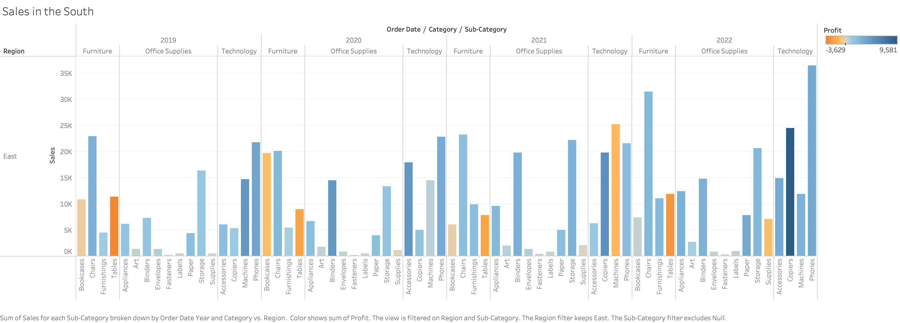
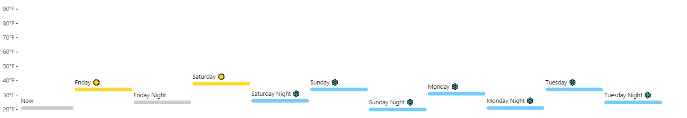
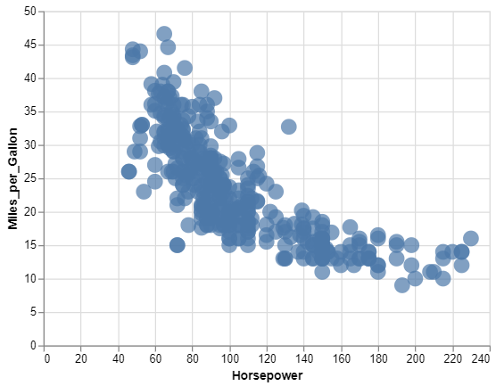
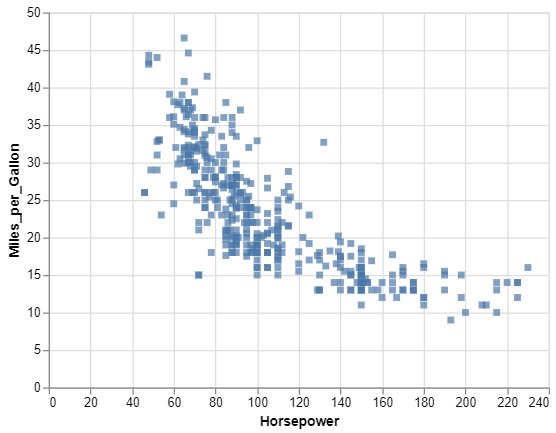
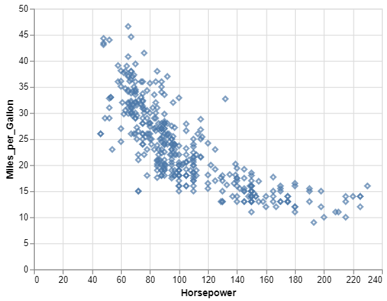
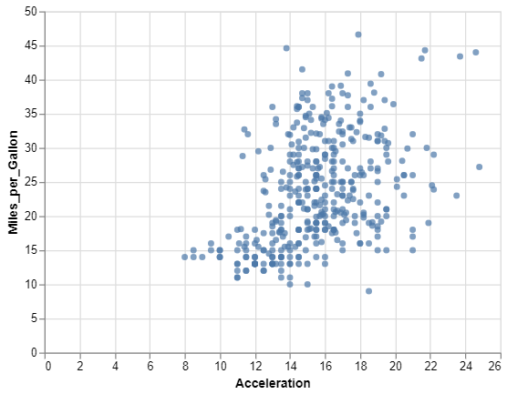
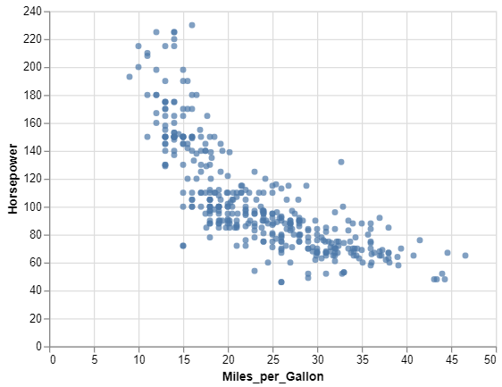
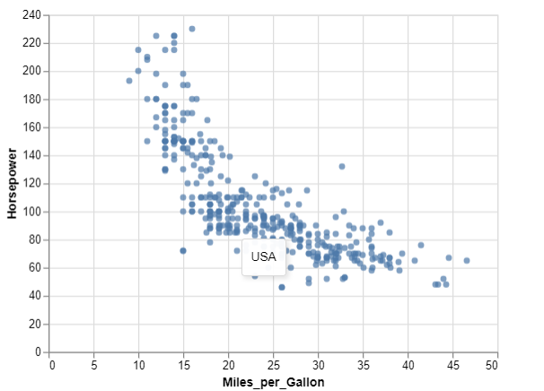
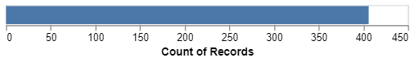
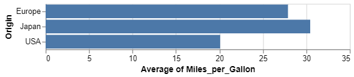

```{r setup, include=FALSE}
knitr::opts_chunk$set(echo = TRUE)
```

## Git, GitHub

1. *What is your GitHub username?*

     ssvsharshithak

2. *What is the URL of your remote GitHub repo (created through Mr. Kennedy's exercises)?*

     https://github.com/ssvsharshithak/myrepo.git
     
     
## R

The command below will load the tidyverse package.  If you have installed R, RStudio, and the tidyverse package, it should display a list of loaded packages and their versions. 


```{r}
library(tidyverse)
```

## R Markdown 

1. *Create a bulleted list with at least 3 items*

    * LIST OF FRUITS
    * APPLE
    * STRAWBERRY
    * MANGO

2. *Write a single paragraph that demonstrates the use of italics, bold, bold italics, code, and includes a link. The paragraph does not have to make sense.*

    **Coffee** is a drink prepared from roasted coffee beans. *Darkly colored, bitter, and slightly acidic*, coffee has a stimulating effect on humans, primarily due to its ***caffeine content***. It is the most popular hot drink in the world.

```python
h = "python is easy to learn"
print h
```
    Link (https://en.wikipedia.org/wiki/Coffee)
    
3. *Create a level 3 heading*

### I'm working on R studio

## R 

#### Data Visualization Exercises

1. (Q2) *How many rows are in mpg? How many columns?*

```{r}
ggplot2::mpg

```
  234 rows and 11 columns
  
1. (Q4) *Make a scatterplot of hwy vs cyl.*

```{r}
ggplot(data = mpg) +
  geom_point(mapping = aes(x = cyl, y = hwy))
```  
  
#### Workflow: basics Exercises

1. (Q2) *Tweak each of the following R commands so that they run correctly (`library(tidyverse)` is correct):*

```r
library(tidyverse)
ggplot(dota = mpg) + 
  geom_point(mapping = aes(x = displ, y = hwy))

fliter(mpg, cyl = 8)

filter(diamond, carat > 3)

```{r}

library(tidyverse)

ggplot(data = mpg) + 
  geom_point(mapping = aes(x = displ, y = hwy))

filter(mpg, cyl == 8)

filter(diamonds, carat > 3)
```

## Google Colab

1. *What are the URLs of your Google Colab notebooks (both Python and R)?*
https://colab.research.google.com/drive/1m2aztLz5-ch_mdJ32NtDa-shd75Vwx3R?usp=sharing

## Tableau

*Insert your the image of your final bar chart here*




1. *What conclusions can you draw from the chart?*
It displays the distinguish between various product sales in different regions.

## Observable and Vega-Lite

### A Taste of Observable

1. *In the "New York City weather forecast" section, try replacing `Forecast: detailedForecast` with `Forecast: shortForecast`. Then press the blue play button  or use Shift-Return to run your change. What happens?*

      When we use detailed forecast we get a detailed explaination of weather forecast.After replacing it with short forecast we get shorter explaination about weather forecast.

1. *Under the scatterplot of temperature vs. name, try replacing `markCircle()` with `markSquare()`. Then press the blue play button  or use Shift-Return to run your change. What happens? How about `markPoint()`?*

    After replacing the markCircle() with markSquare() we get squares instead of circles on scatterplot of temperature vs name.

1. *Under "Pick a location, see the weather forecast", pick a location on the map.  Where was the point you picked near?*

       Longitude: -108.86     Latitude: 47.7
       Zortman, MT

1. *The last visualization on this page is a "fancy" weather chart embedded from another notebook.  Click on the 3 dots next to that chart and choose 'Download PNG'.  Insert the PNG into your report.*

  

### Charting with Vega-Lite

`markCircle()`

1. *Pass an option of `{ size: 200 }` to `markCircle()`.*




1. *Try `markSquare` instead of `markCircle`.*



1. *Try `markPoint({ shape: 'diamond' })`.*



`vl.x().fieldQ("Horsepower")`, ...

1. *Change `Horsepower` to `Acceleration`*




1. *Swap what fields are displayed on the x- and y-axis*



`vl.tooltip().fieldN("Name")`

1. *Change `Name` to `Origin`.*



Another example, `count()`

1. *Remove the `vl.y().fieldN("Origin")` line.*
  
    
    
1. *Replace `count()` with `average("Miles_per_Gallon")`.*


    

## References

*Every report must list the references that you consulted while completing the assignment. If you consulted a webpage, you must include the URL.*

* Reference 1, https://r4ds.had.co.nz/workflow-basics.html#practice
* Reference 2, https://colab.research.google.com/drive/165dTuQy5P7cgG8QqZMuLWP02LD9fLpLJ#scrollTo=qJAKN6380cJc
* Reference 3, https://observablehq.com/@tomb/a-taste-of-observable
* Reference 4, https://www.tableau.com/academic/students
* Reference 5, https://r4ds.had.co.nz/workflow-basics.html#practice
* Reference 6, https://colab.research.google.com/drive/165dTuQy5P7cgG8QqZMuLWP02LD9fLpLJ#scrollTo=s8aeChJ4_pgz
